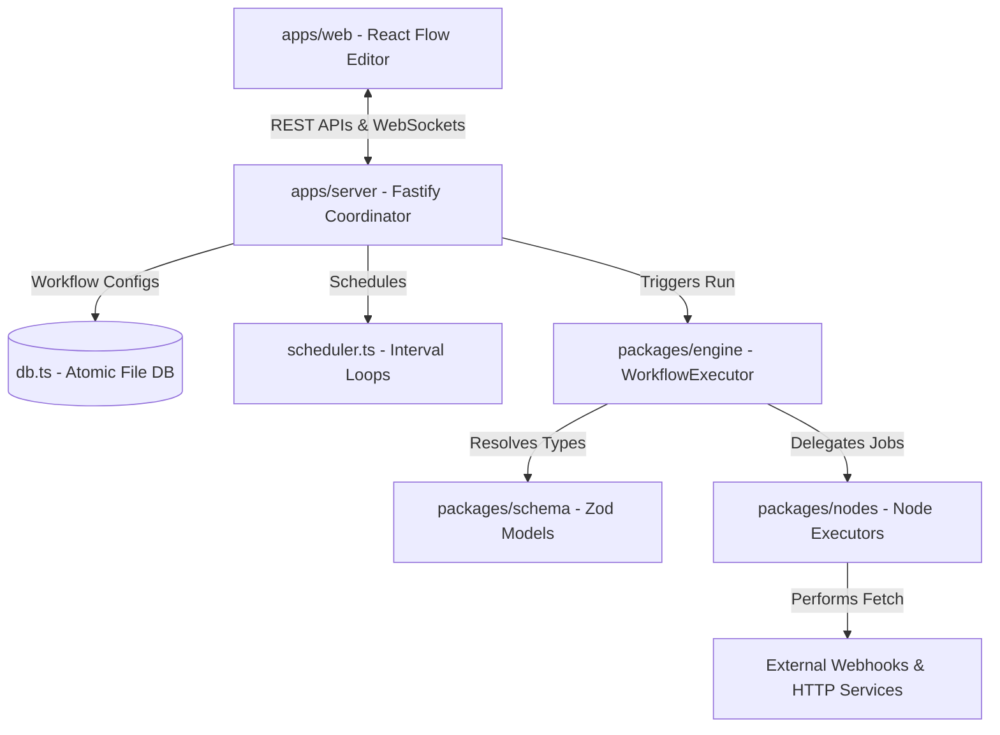

# 🧶 Skein

Skein is a high-performance, interactive visual workflow builder and framework-agnostic AI-agent execution runtime. Decoupled into a clean Turborepo monorepo, it offers type-safe node connection validation, real-time live execution updates over WebSockets, repeatable cron scheduling, and standalone workflow code compilation.

---

## ✨ Key Features

1. **📺 Live Observable DAG Execution**: Nodes animate dynamically through statuses (`idle`, `running` 🔵, `success` 🟢, `error` 🔴, `skipped` ⚪) on the canvas, rendering output payloads and execution errors inline inside node cards in real-time.
2. **🛡️ Connection-Time Type Safety**: Connecting two handles enforces type checks (supporting `string`, `number`, `boolean`, `array`, `object`, and `any`). Mismatched links are rejected on-screen with toast warnings.
3. **🚀 Framework-Agnostic Execution Engine**: A standalone, queue-based topological execution core inside `packages/engine` that schedules nodes, handles branching, resolves variable paths, and executes parallel paths concurrently.
4. **📦 Zero-Dependency Standalone Export**: Easily bundle any saved visual workflow graph directly into a single, clean executable TypeScript module.
5. **⏰ In-Memory Repeating Schedules**: Automatically schedule repeatable workflow runs with standard cron syntax using a lightweight timer scheduler.

---

## 🛠️ Tech Stack & Workspace Structure

Skein is structured as a **Turborepo** monorepo managed with `pnpm` workspaces:

```
skein/
├── apps/
│   ├── web/           # React 19 + TypeScript + Vite + Tailwind canvas editor UI
│   └── server/        # Fastify server providing REST APIs, WebSocket streaming & schedules
└── packages/
    ├── schema/        # Zod validation models and type definitions for workflows
    ├── nodes/         # Core built-in execution rules for manual trigger, webhook, httpRequest, etc.
    └── engine/        # Topological sort cycle checker and concurrent execution engine
```

---

## 🏗️ Architecture Flow



---

## 🚀 Quick Start

### Prerequisites

- [Node.js](https://nodejs.org/) v20+
- [pnpm](https://pnpm.io/) v8+

### Setup & Installation

Clone and install dependencies:

```bash
# Install and link workspace dependencies
pnpm install

# Build all packages and applications
pnpm build
```

### Run the Development Environments

Start both the frontend Vite canvas and Fastify server concurrently:

```bash
# Boots web (port 5173) and server (port 3001)
pnpm dev
```

- **Frontend**: http://localhost:5173
- **Backend API**: http://localhost:3001
- **Health Check**: http://localhost:3001/health

---

## ⚙️ REST API & Triggering Workflows

Skein exposes simple REST APIs to manage and trigger workflows:

### Workflows REST endpoints:

- `GET /api/workflows` - List saved workflows.
- `POST /api/workflows` - Create/update a workflow schema.
- `GET /api/workflows/:id/runs` - Retrieve run history.

### Manually trigger execution:

```bash
curl -X POST http://localhost:3001/api/workflows/:id/run \
  -H "Content-Type: application/json" \
  -d '{"payload": {"userId": 100, "action": "promote"}}'
```

### Triggering via webhook:

If a workflow starts with a `webhook-trigger` node, it exposes a dedicated webhook entrypoint:

```bash
curl -X POST http://localhost:3001/api/webhooks/:workflowId \
  -H "Content-Type: application/json" \
  -d '{"score": 88}'
```

---

## 🧪 Testing

Skein has comprehensive unit and end-to-end tests:

```bash
# Run package unit tests (Vitest)
pnpm test

# Run UI builder browser tests (Playwright)
npx playwright test
```

---

## 💡 Production Scaling (Upgrades)

To maintain a zero-config onboarding workflow, Skein ships with embedded implementations:

- **Persistence (`apps/server/src/db.ts`)**: Uses file-backed JSON directories. _Upgrade Path:_ Swap out with PostgreSQL / SQLite and Prisma Client.
- **Queueing & Scheduling (`apps/server/src/scheduler.ts`)**: Uses in-memory interval loops. _Upgrade Path:_ Swap out with Redis and BullMQ.
