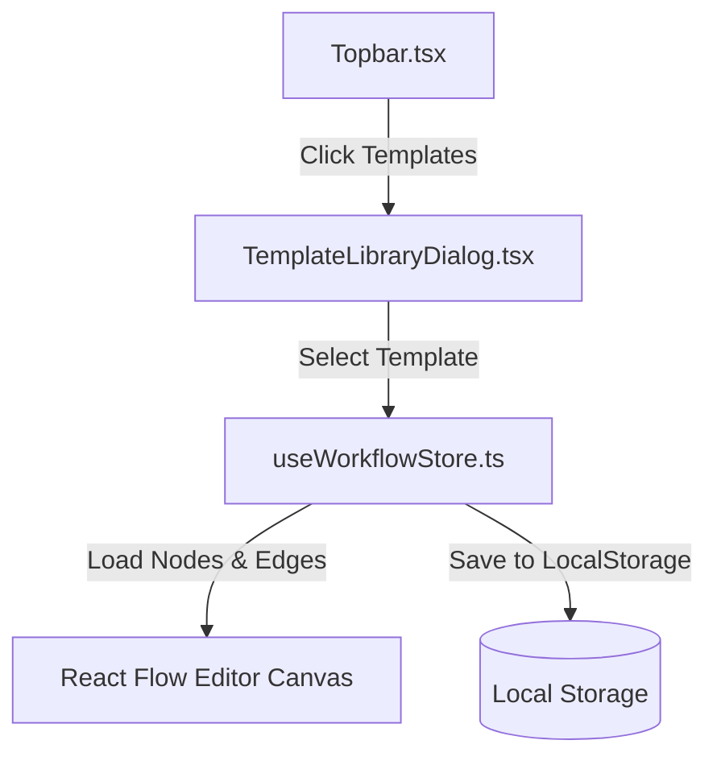

# Design Spec: Skein Workflow Template Library & 5 Prebuilt Templates

## Status
Accepted

## Context
Skein lacks a quick-start template mechanism. Users starting out with the canvas editor must create every workflow from scratch, which slows down onboarding and onboarding validation. Adding a template library dialog with pre-configured node-graphs makes the application much more accessible and demonstrates the capabilities of Skein immediately.

## Proposed Architecture: Frontend-Only Template Catalog

We adopt a frontend-only static catalog for pre-configured templates. When a template is loaded, the editor initializes a fresh workflow and populates the Zustand store with the template's predefined nodes and edges.



---

## ADR-001: Frontend-Only Template Registry

### Status
Accepted

### Context
We need to determine where to store the template definitions. Option A is frontend-only static JSON, Option B is a backend Fastify API serving templates from `data/`, and Option C is database seeding.

### Decision
 We will use **Option A (Frontend-Only Static Catalog)** in `apps/web/src/constants/templates.ts`. 

### Consequences
* **Easier**: Zero network latency when browsing or opening the dialog. Zero backend additions/schema migrations required. No risk of database pollution for users who just want to explore.
* **Harder**: Updates to the templates require compiling and releasing a new frontend build, though templates are expected to remain stable.

---

## 5 Prebuilt Templates Architecture

Each template maps exactly to nodes, edges, and configurations compatible with Skein's packages:

### 1. AI Support Ticket Router
* **Category**: AI / Integration
* **Nodes**:
  * `webhook-trigger` (node-webhook): Receives customer ticket payload.
  * `llm-prompt` (node-classifier): Checks the ticket payload (`{{input.body.message}}`) and classifies it into `"billing"`, `"technical"`, or `"feedback"`.
  * `condition` (node-condition): Expression: `input === "billing"`.
  * `http-request` (node-slack-billing): Triggers POST Webhook to Slack Billing channel.
  * `http-request` (node-slack-general): Triggers POST Webhook to Slack Support channel.
* **Edges**:
  * `node-webhook.body` $\rightarrow$ `node-classifier.prompt`
  * `node-classifier.response` $\rightarrow$ `node-condition.value`
  * `node-condition.true` $\rightarrow$ `node-slack-billing.body`
  * `node-condition.false` $\rightarrow$ `node-slack-general.body`

### 2. Weekly Performance Summarizer
* **Category**: Schedules / AI
* **Nodes**:
  * `schedule-trigger` (node-schedule): Cron set to run every Monday at 9 AM (`0 9 * * 1`).
  * `http-request` (node-fetch-metrics): Performs GET to fetch metrics data.
  * `llm-prompt` (node-llm-summarizer): Generates executive summary of the response payload.
  * `log-debug` (node-log-output): Prints out the summary markdown block.
* **Edges**:
  * `node-schedule.timestamp` $\rightarrow$ `node-fetch-metrics.body`
  * `node-fetch-metrics.response` $\rightarrow$ `node-llm-summarizer.prompt`
  * `node-llm-summarizer.response` $\rightarrow$ `node-log-output.data`

### 3. AI Translation & Localizer
* **Category**: AI / Logic
* **Nodes**:
  * `manual-trigger` (node-manual): Default payload `{"text": "Hello world"}`.
  * `llm-prompt` (node-translate-es): Translates `{{input}}` to Spanish.
  * `llm-prompt` (node-translate-fr): Translates `{{input}}` to French.
  * `transform` (node-combine): Code-based transformation:
    ```javascript
    return {
      spanish: input.spanish,
      french: input.french
    };
    ```
  * `http-request` (node-publish): Sends formatted JSON to external CMS.
* **Edges**:
  * `node-manual.payload` $\rightarrow$ `node-translate-es.prompt`
  * `node-manual.payload` $\rightarrow$ `node-translate-fr.prompt`
  * `node-translate-es.response` $\rightarrow$ `node-combine.input`
  * `node-combine.output` $\rightarrow$ `node-publish.body`

### 4. Data Sync Pipeline with Throttling
* **Category**: Logic / Integration
* **Nodes**:
  * `webhook-trigger` (node-trigger)
  * `http-request` (node-get-users): Fetches external user list.
  * `loop` (node-loop): Loops over list array.
  * `transform` (node-formatter): Formats name strings and keys.
  * `http-request` (node-upsert): Sends individual contact object to CRM.
  * `delay` (node-delay): Enforces 2-second rate-limiting cooldown.
* **Edges**:
  * `node-trigger.body` $\rightarrow$ `node-get-users.body`
  * `node-get-users.response` $\rightarrow$ `node-loop.array`
  * `node-loop.item` $\rightarrow$ `node-formatter.input`
  * `node-formatter.output` $\rightarrow$ `node-upsert.body`
  * `node-upsert.status` $\rightarrow$ `node-delay.input`

### 5. Smart Autonomous Agent Loop
* **Category**: AI
* **Nodes**:
  * `manual-trigger` (node-trigger)
  * `llm-prompt` (node-agent): Set to OpenAI Model.
  * `tool-call` (node-tool): Registered search tool named `web_search`.
  * `transform` (node-format): Code to parse search JSON results.
  * `log-debug` (node-log): Output search results.
* **Edges**:
  * `node-trigger.payload` $\rightarrow$ `node-agent.prompt`
  * `node-agent.response` $\rightarrow$ `node-tool.args`
  * `node-tool.result` $\rightarrow$ `node-format.input`
  * `node-format.output` $\rightarrow$ `node-log.data`

---

## Dialog UI Specifications

### 1. Trigger
A text button "Templates" added to `Topbar.tsx` right next to the "New" button.
* SVG icon: A template layout or document grid icon.

### 2. Dialog Layout
A centered `<dialog>` or custom `div` overlay using React portals/state:
* **Background Blur**: `backdrop-blur-sm bg-black/60`
* **Card Grid**: Grid layout of 2 columns containing the 5 templates.
* **Search Field**: Real-time filtering search bar.
* **Visual Nodes List**: Visual badge timeline showing the flow structure.

### 3. Load Action Flow
1. User clicks **"Load Template"**.
2. If canvas nodes count > 0:
   * Prompt confirmation: "This will overwrite your unsaved canvas workflow. Do you want to proceed?"
3. Store updates:
   * Replaces `nodes` and `edges` list.
   * Generates a new unique `activeWorkflowId`.
   * Sets `activeWorkflowName` to the template name.
   * Clears undo/redo past & future history stacks.
4. Triggers success toast.
5. Closes the dialog.
